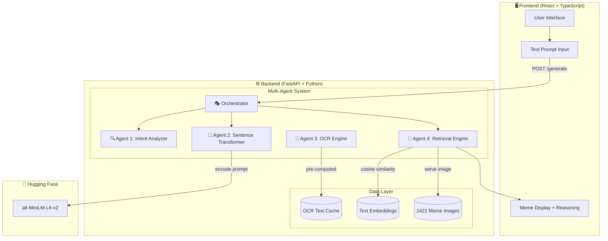
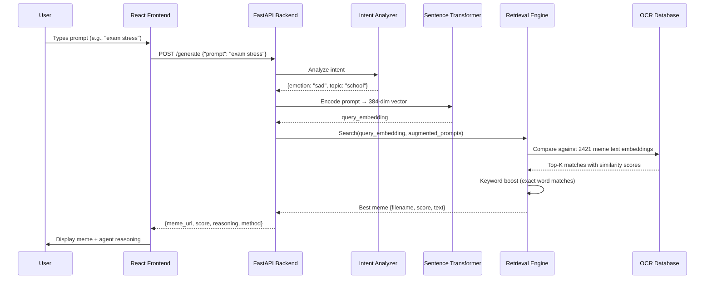
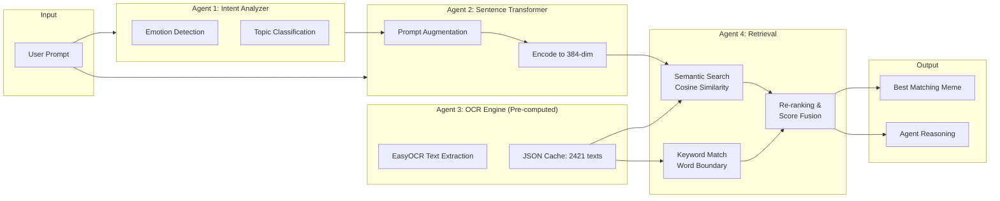
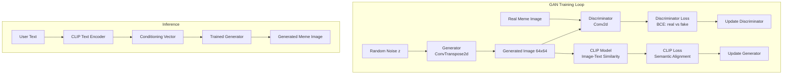
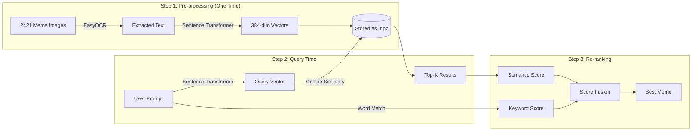

# 🧠 MemeGenius — AI-Powered Meme Generator

An intelligent meme retrieval system built using a **Multi-Agent AI Architecture** with Sentence Transformers, OCR, and a GAN component. The system understands natural language prompts and retrieves the most semantically relevant meme from a dataset of **2400+ images**.

> **Model Used:** `sentence-transformers/all-MiniLM-L6-v2` from Hugging Face  
> **Method:** Semantic text similarity via OCR-extracted meme content

---

## 📐 System Architecture



---

## 🔄 Workflow: How a Meme is Generated



---

## 🏗️ Multi-Agent Architecture Detail



---

## 🧪 GAN Training Pipeline (Academic Component)



---

## 🛠️ Tech Stack

| Layer | Technology | Purpose |
|-------|-----------|---------|
| Frontend | React 18 + TypeScript | User interface |
| Styling | Tailwind CSS + Framer Motion | UI design + animations |
| Bundler | Vite | Fast dev/build |
| Backend | FastAPI (Python) | REST API server |
| AI Model | `all-MiniLM-L6-v2` | Semantic text similarity |
| OCR | EasyOCR | Extract text from meme images |
| ML Framework | PyTorch | Model inference + GAN training |
| GAN | DCGAN | Image generation (academic) |
| Data | 2421 meme images | Retrieval dataset |

---

## 📂 Project Structure

```
MEME-GENERATOR/
├── src/                          # React Frontend
│   ├── pages/
│   │   ├── Home.tsx              # Landing page
│   │   ├── Generate.tsx          # AI meme generator page
│   │   └── Gallery.tsx           # Template browser
│   ├── components/
│   │   ├── Navbar.tsx            # Navigation with theme toggle
│   │   └── ThemeProvider.tsx     # Dark/light mode
│   ├── lib/
│   │   └── memeTemplates.ts     # Template metadata
│   ├── App.tsx                   # Router setup
│   └── main.tsx                  # Entry point
│
├── backend/                      # Python Backend
│   ├── app.py                    # FastAPI server (multi-agent system)
│   ├── train_gan.py              # GAN training script
│   ├── precompute_ocr.py        # OCR batch processing
│   ├── ocr_texts.json           # Cached OCR results
│   ├── text_embeddings.npz      # Pre-computed embeddings
│   ├── requirements.txt         # Python dependencies
│   ├── start.sh                 # Startup script
│   ├── .env                     # HF_TOKEN (not committed)
│   └── .venv/                   # Python virtual environment
│
├── meme_folder/                  # Dataset
│   ├── media/                    # 2421 meme images
│   └── thumbnails/               # Thumbnail versions
│
├── package.json                  # Frontend dependencies
├── tailwind.config.js            # Tailwind configuration
├── vite.config.ts                # Vite configuration
├── vercel.json                   # Frontend deployment config
└── README.md                     # This file
```

---

## 🚀 Local Setup

### Prerequisites
- Node.js 18+
- Python 3.12+
- `uv` package manager (recommended) or `pip`

### 1. Clone & Install Frontend

```bash
git clone <repo-url>
cd MEME-GENERATOR
npm install
```

### 2. Setup Backend

```bash
cd backend

# Create virtual environment
uv venv --python 3.12 .venv
source .venv/bin/activate

# Install dependencies
uv pip install -r requirements.txt

# Set Hugging Face token (optional, speeds up downloads)
echo "HF_TOKEN=your_token_here" > .env
```

### 3. Pre-compute OCR (First Time Only)

This extracts text from all 2421 meme images (~30 minutes on CPU):

```bash
python precompute_ocr.py
```

### 4. Start the Application

**Terminal 1 — Backend:**
```bash
cd backend
./start.sh
# Or manually:
source .venv/bin/activate
python -m uvicorn app:app --host 0.0.0.0 --port 8000
```

**Terminal 2 — Frontend:**
```bash
npm run dev
```

### 5. Open in Browser

- Frontend: http://localhost:5173
- Backend API: http://localhost:8000
- Health Check: http://localhost:8000/health

---

## 📊 How the Matching Works



### Scoring Formula
```
If keyword_score > 0.6:
    final = keyword × 0.7 + semantic × 0.3
Else:
    final = semantic × 0.8 + keyword × 0.2
```

---

## 🎓 GAN Training (Academic Requirement)

Train a DCGAN on the meme dataset with optional CLIP guidance:

```bash
cd backend
source .venv/bin/activate

# Basic training
python train_gan.py --epochs 50 --batch_size 32

# With CLIP-guided generation
python train_gan.py --epochs 50 --use_clip --clip_prompt "a funny meme"
```

### GAN Architecture
- **Generator:** 5-layer ConvTranspose2d (noise → 64×64 RGB image)
- **Discriminator:** 5-layer Conv2d (image → real/fake probability)
- **CLIP Loss:** Ensures generated images align with text semantically

---

## 🌐 Deployment

### Backend → Render.com (Free Tier)

1. Create a new Web Service on [render.com](https://render.com)
2. Connect your GitHub repo
3. Set:
   - **Build Command:** `pip install -r requirements.txt`
   - **Start Command:** `uvicorn app:app --host 0.0.0.0 --port $PORT`
   - **Root Directory:** `backend`
4. Add environment variable: `HF_TOKEN`
5. Upload `ocr_texts.json` and `text_embeddings.npz` with the code

### Frontend → Vercel (Free)

1. Connect repo to [vercel.com](https://vercel.com)
2. Set environment variable:
   ```
   VITE_API_URL=https://your-backend.onrender.com
   ```
3. Deploy

---

## 📈 Performance

| Metric | Value |
|--------|-------|
| Dataset Size | 2421 images |
| OCR Coverage | 100% (all images processed) |
| Embedding Dimensions | 384 |
| Query Latency | ~50ms |
| Model Size | 80MB (all-MiniLM-L6-v2) |
| Startup Time | ~10 seconds |

---

## 🔮 Future Improvements

- [ ] Fine-tune Sentence Transformer on meme-specific text pairs
- [ ] Add image captioning (BLIP-2) for memes without text
- [ ] Train GAN to completion for image generation
- [ ] Add user feedback loop to improve retrieval
- [ ] Implement meme text overlay on generated images
- [ ] Multi-language meme support

---

## 📄 License

MIT

---

## 👤 Author

Built as an academic project demonstrating:
- Multi-Agent AI Systems
- Hugging Face Model Integration
- GAN + CLIP Architecture
- Semantic Search & Information Retrieval
- Full-Stack Application Development
